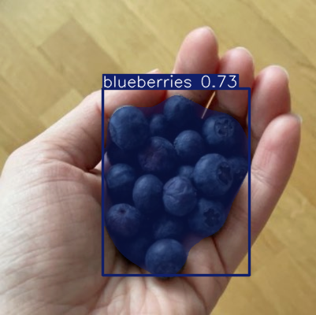

# Food Recognition System | System Rozpoznawania Żywności

**Language | Język**: [English](#english) | [Polski](#polski)

---

<a name="english"></a>
# Food Recognition System


## 📝 Project Overview

A computer vision system for food recognition using YOLO (You Only Look Once) segmentation models. This project implements real-time food detection and segmentation capable of identifying items from nearly 500 different food classes.

## 🔑 Key Features

- Real-time food object detection and segmentation
- Support for nearly 500 food classes
- Instance segmentation with pixel-level accuracy
- Optimized for performance on consumer hardware

## 🛠️ Technologies

- **YOLO11n-seg**: Lightweight segmentation model from the YOLOv8 family
- **PyTorch**: Deep learning framework
- **COCO Dataset Format**: For initial data preparation
- **GPU Acceleration**: For efficient model training

## 📊 Dataset

The system was trained on the food-recognition-2022 dataset containing:
- **Training set**: 76,491 annotations across 498 food classes
- **Validation set**: 1,830 annotations across 498 food classes

### Data Preparation

We developed a pipeline to convert the original COCO JSON format into the YOLO-compatible format:
- Images resized to 640×640
- Labels converted to YOLO format (class_id, x_center, y_center, width, height)
- Created dataset.yaml with all class names

## 🧠 Model Architecture & Training

The model is based on YOLOv8, pre-trained on the COCO dataset (80 common object classes) and fine-tuned on our food dataset. We utilized transfer learning to adapt the model to the food domain.

### Training Parameters

- **Model**: YOLO11n-seg (nano segmentation variant)
- **Epochs**: 40
- **Learning Rate**: Dynamic with warmup and decay
- **Loss Components**:
  - Box Loss: For bounding box regression
  - Classification Loss: For food class identification
  - DFL (Distribution Focal Loss): For better bbox boundary prediction
  - Segmentation Loss: For pixel-level mask prediction
- **Regularization**: Weight decay to prevent overfitting

## 📈 Results & Performance Analysis

The model completed training after 40 epochs. While not optimal, it demonstrates the capabilities of the approach.

### High-Performance Classes (F1 ≈ 0.995)
- Fruit salad
- Croissant
- Popcorn salted
- Chorizo
- Wine rose

### Challenging Classes (F1 < 0.1)
- Chocolate (0.103)
- Basil (0.016)
- Nectarine (0.0815)
- Cottage cheese (0.0822)
- Ham (0.0148)

### Performance Metrics

- **mAP (mean Average Precision)**: ~0.2 (competitive with early YOLO implementations)
- **Precision**: High at maximum confidence threshold (~0.95)
- **Recall**: Generally lower than precision, indicating conservative predictions
- **Train-validation difference**: Small, suggesting good generalization

### Observations

- The model demonstrates better precision than recall, meaning it's more likely to miss objects than to give false positives
- Learning continues through all epochs, suggesting potential for improvement with extended training
- Box Loss and Segmentation Loss remained the highest, indicating challenges with precise localization and shape delineation
- Classification performance was relatively stronger than localization performance

## 🚀 Usage

```python
# Example code for inference
from ultralytics import YOLO

# Load the trained model
model = YOLO("path/to/trained/model.pt")

# Perform inference on an image
results = model("path/to/food/image.jpg")

# Display results
results[0].show()
```

## 📦 Installation

This project uses [uv](https://github.com/astral-sh/uv) as its Python package manager for fast, reliable dependency management.

### Prerequisites

- Python 3.13 or higher
- Git

### Installation Steps

1. **Install uv** (if not already installed):

```bash
curl -LsSf https://astral.sh/uv/install.sh | sh
```

2. **Clone the repository**:

```bash
git clone https://github.com/yourusername/food-recognition-system.git
cd food-recognition-system
```

3. **Create a virtual environment and install dependencies**:

```bash
uv venv
source .venv/bin/activate  # On Windows: .venv\Scripts\activate
uv pip install -e .
```

4. **Verify installation**:

```bash
python -c "from ultralytics import YOLO; print('Installation successful!')"
```

## 🔮 Future Improvements

- Extended training with more epochs
- Class balancing to improve performance on challenging classes
- Data augmentation to enhance generalization
- Model architecture experiments with larger variants (YOLO11m-seg, YOLO11l-seg)
- Hyperparameter optimization, particularly for box and segmentation loss components

## 👥 Contributors

This project was developed as part of academic coursework of Jakub Bożek and Karolina Klemenska at University of Gdańsk.

## 📄 License

This project is licensed under the MIT License - see the [LICENSE](LICENSE) file for details.


---

<a name="polski"></a>
# System Rozpoznawania Żywności


## 📝 Przegląd Projektu

System wizji komputerowej do rozpoznawania żywności wykorzystujący modele segmentacji YOLO (You Only Look Once). Projekt implementuje wykrywanie i segmentację żywności w czasie rzeczywistym, zdolną do identyfikacji produktów z niemal 500 różnych klas żywności.

## 🔑 Kluczowe Funkcje

- Wykrywanie i segmentacja obiektów żywnościowych w czasie rzeczywistym
- Obsługa prawie 500 klas żywności
- Segmentacja instancji z dokładnością na poziomie pikseli
- Zoptymalizowany pod kątem wydajności na sprzęcie konsumenckim

## 🛠️ Technologie

- **YOLO11n-seg**: Lekki model segmentacji z rodziny YOLOv8
- **PyTorch**: Framework do głębokiego uczenia
- **Format Danych COCO**: Do wstępnego przygotowania danych
- **Akceleracja GPU**: Do efektywnego treningu modelu

## 📊 Zbiór Danych

System został wytrenowany na zbiorze danych food-recognition-2022 zawierającym:
- **Zbiór treningowy**: 76 491 adnotacji w 498 klasach żywności
- **Zbiór walidacyjny**: 1 830 adnotacji w 498 klasach żywności

### Przygotowanie Danych

Opracowaliśmy pipeline do konwersji oryginalnego formatu JSON COCO na format kompatybilny z YOLO:
- Obrazy przeskalowane do 640×640
- Etykiety przekonwertowane do formatu YOLO (id_klasy, x_środek, y_środek, szerokość, wysokość)
- Utworzono plik dataset.yaml ze wszystkimi nazwami klas

## 🧠 Architektura Modelu i Trening

Model bazuje na YOLOv8, wstępnie wytrenowanym na zbiorze danych COCO (80 typowych klas obiektów) i dostrojonym na naszym zbiorze danych żywności. Wykorzystaliśmy transfer learning do adaptacji modelu do domeny żywności.

### Parametry Treningu

- **Model**: YOLO11n-seg (wariant nano segmentacji)
- **Epoki**: 40
- **Współczynnik uczenia**: Dynamiczny z rozgrzewką i zanikaniem
- **Komponenty funkcji straty**:
  - Box Loss: Do regresji bounding boxów
  - Classification Loss: Do identyfikacji klas żywności
  - DFL (Distribution Focal Loss): Do lepszego przewidywania granic bboxów
  - Segmentation Loss: Do przewidywania masek na poziomie pikseli
- **Regularyzacja**: Zanikanie wag, aby zapobiec przeuczeniu

## 📈 Analiza Wyników i Wydajności

Model zakończył trening po 40 epokach. Choć nie jest optymalny, demonstruje możliwości podejścia.

### Klasy o Wysokiej Wydajności (F1 ≈ 0.995)
- Sałatka owocowa
- Croissant
- Popcorn solony
- Chorizo
- Wino różowe

### Trudne Klasy (F1 < 0.1)
- Czekolada (0.103)
- Bazylia (0.016)
- Nektarynka (0.0815)
- Twaróg (0.0822)
- Szynka (0.0148)

### Metryki Wydajności

- **mAP (średnia Precyzja)**: ~0.2 (konkurencyjna wobec wczesnych implementacji YOLO)
- **Precyzja**: Wysoka przy maksymalnym progu pewności (~0.95)
- **Czułość**: Ogólnie niższa niż precyzja, wskazując na konserwatywne przewidywania
- **Różnica trening-walidacja**: Mała, sugerująca dobrą generalizację

### Obserwacje

- Model wykazuje lepszą precyzję niż czułość, co oznacza, że jest bardziej skłonny do pominięcia obiektów niż do fałszywych alarmów
- Uczenie kontynuowane przez wszystkie epoki, sugerujące potencjał do poprawy przy przedłużonym treningu
- Box Loss i Segmentation Loss pozostały najwyższe, wskazując na wyzwania z precyzyjną lokalizacją i delineacją kształtu
- Wydajność klasyfikacji była stosunkowo silniejsza niż wydajność lokalizacji

## 🚀 Użycie

```python
# Przykładowy kod do wnioskowania
from ultralytics import YOLO

# Załaduj wytrenowany model
model = YOLO("ścieżka/do/wytrenowanego/modelu.pt")

# Wykonaj wnioskowanie na obrazie
results = model("ścieżka/do/obrazu/żywności.jpg")

# Wyświetl wyniki
results[0].show()
```

## 📦 Instalacja

Ten projekt wykorzystuje [uv](https://github.com/astral-sh/uv) jako menedżer pakietów Python dla szybkiego i niezawodnego zarządzania zależnościami.

### Wymagania wstępne

- Python 3.13 lub nowszy
- Git

### Kroki instalacji

1. **Zainstaluj uv** (jeśli nie jest jeszcze zainstalowany):

```bash
curl -LsSf https://astral.sh/uv/install.sh | sh
```

2. **Sklonuj repozytorium**:

```bash
git clone https://github.com/twojnazwauzytkownika/system-rozpoznawania-zywnosci.git
cd system-rozpoznawania-zywnosci
```

3. **Utwórz środowisko wirtualne i zainstaluj zależności**:

```bash
uv venv
source .venv/bin/activate  # W Windows: .venv\Scripts\activate
uv pip install -e .
```

4. **Zweryfikuj instalację**:

```bash
python -c "from ultralytics import YOLO; print('Instalacja zakończona sukcesem!')"
```

## 🔮 Przyszłe Ulepszenia

- Rozszerzony trening z większą liczbą epok
- Zbalansowanie klas w celu poprawy wydajności dla trudnych klas
- Augmentacja danych w celu zwiększenia generalizacji
- Eksperymenty z architekturą modelu z większymi wariantami (YOLO11m-seg, YOLO11l-seg)
- Optymalizacja hiperparametrów, szczególnie dla komponentów Box Loss i Segmentation Loss

## 👥 Współtwórcy

Projekt został opracowany jako część pracy akademickiej Jakuba Bożka i Karoliny Klemenskiej na Uniwersytecie Gdańskim.

## 📄 Licencja

Ten projekt jest licencjonowany na mocy licencji MIT - zobacz plik [LICENSE](LICENSE) dla szczegółów.

